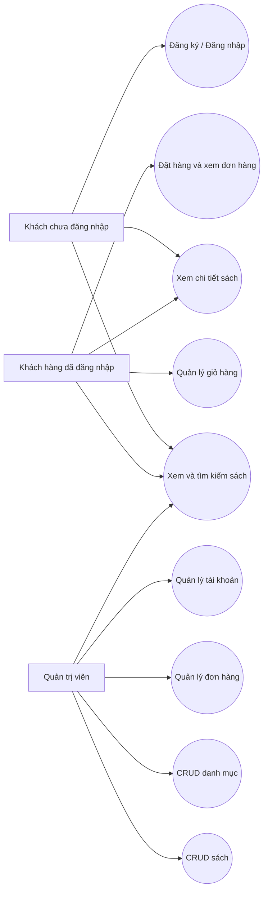

# UML Use Case – BookNest

```mermaid
flowchart LR
    Guest[Khách chưa đăng nhập]
    User[Khách hàng đã đăng nhập]
    Admin[Quản trị viên]
    UC1((Xem và tìm kiếm sách))
    UC2((Xem chi tiết sách))
    UC3((Đăng ký / Đăng nhập))
    UC4((Quản lý giỏ hàng))
    UC5((Đặt hàng và xem đơn hàng))
    UC6((CRUD sách))
    UC7((CRUD danh mục))
    UC8((Quản lý đơn hàng))
    UC9((Quản lý tài khoản))
    Guest --> UC1
    Guest --> UC2
    Guest --> UC3
    User --> UC1
    User --> UC2
    User --> UC4
    User --> UC5
    Admin --> UC1
    Admin --> UC6
    Admin --> UC7
    Admin --> UC8
    Admin --> UC9
```

Sơ đồ này là nguồn Mermaid để đưa vào báo cáo; cần đối chiếu tên chức năng với giao diện chạy thực tế trước khi nộp.
